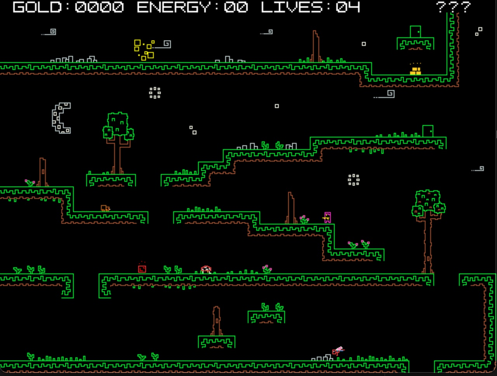

# Pixeus - A Platformer Adventure for the Commander X16
This is a game for the [Commander X16](https://cx16forum.com/) system written in C. The original purpose was to learn how to code on the CX16, including all of its video, sprite, audio, and kernal functionality. The end result is Pixeus, a platformer with colorful pixel/line graphics.



## What is the Commander X16
In a nutshell, the CX16 is a new 8-bit system based on the 65c02 processor (popular in many 80s/90s systems like the C64 and NES). It is a spiritual successor to the C64/C128 and even boots into a very similar BASIC prompt. It is NOT compatible with those systems though as the CX16 includes a more advanced graphics/sound chip. The goal is to have a better supported 8-bit system for folks to hack on. There is an emulator for developing on, and actual hardware will be available in the near future.

See [Their FAQ](https://cx16forum.com/faq.html) for more info

## Requirements
- The [cc65](https://cc65.github.io/) cross development package for 65(C)02 systems.
- The Commander X16 emulator. It can be found in the download section on their [main site](https://cx16forum.com/)

## Building
Building the and running `.prg` file
```
make
``` 
will build the `pixeus.prg` file which can then be run in the emulator with

```
make run
```
This command executes: `[path-to-emulator]/x16emu -prg pixeus.prg -run`

`x16emu` is the emulator so use the appropriate path to that executable if it exists elsewhere.

## Level Design
The levels are built using the amazing level editor [LDtk](https://ldtk.io/). The .ldtk file and tileset images are included with this repo. To use the levels in Pixeus, I wrote a NodeJS (JavaScript) program to convert the level data into binary files that can be loaded at runtime into the C level structs. You need to regenerate the .bin files after any updates made in LDtk.

DEV NOTE: There is a `#define CACHED_ENTITY_LIST_LENGTH` in `entitymgr.c` that may need to be increased as more levels are added.

To generate the level .bin files:
```
make level
```
This will create a series of level#.bin files in the `levels` folder.

## Tilesets and Sprite Images
I'm using GIMP to make the images for my tilesets and sprites. Pixeus runs in 256 color/8bpp mode and I don't read in .png files, so to use images from GIMP they need to be converted to something Pixeus can read. The conversion util maps each color to a CX16 palette index and handles image "frames" so you can lay out your animation frames how you like in the image. There are a few steps:

In GIMP:

1. Combine all layers into 1 layer
1. Remove any transparency/alpha from the layer (Layer -> Transparency -> Remove Alpha Channel)
1. "Export" the image and Select "Raw image data" as the file type
1. Save the `.data` file in the `tools` folder

Now convert the `.data` file into a `.bin` file useable in Pixeus.

In the `makefile` there is a command `img`. Add a new line to the command for the image as follow:

```
node gimp-convert-tiles-bin.js FILENAME.data X_FRAMES Y_FRAMES PIXEL_WIDTH PIXEL_HEIGHT

#Example - 4 frames, each 16x16 pixels
node gimp-convert-tiles-bin.js guyscuba.data 4 1 16 16
```

To generate all of the images, run:
```
make img
```

## Main Title Image
If changed, the main title image also needs to be converted in a similar way as the sprites/tilesets. Follow the same steps to create the `title.data` file. Then when you run `make img` the image will be updated.

## Palette File
The images in Pixeus use a few colors that didn't map well to the standard CX16 palette. Therefore, some colors in the 16-30-ish range have been replaced. There is a file `tools/palette.json` that contains the list of CX16 RGB colors Pixeus uses. There is a nodeJS program that converts this to `palette.bin` which can then be loaded into the palette area of the CX16. If you update any of the colors in `tools/palette.json`, you need to regenerate the `palette.bin` by running:

```
make pal
```

## License
See the [license file](./license.md)